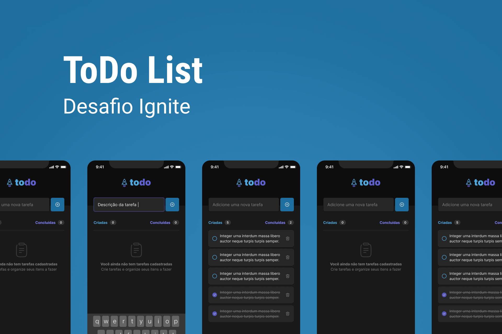

<p align="center">
  
</p>

<p align="center">
  
  

     
</p>

<h1 align="center">
    
</h1>

<br>

## 🧪 Tecnologias

Esse projeto foi desenvolvido com as seguintes tecnologias:

- [React Native](https://reactnative.dev/)
- [TypeScript](https://www.typescriptlang.org/)
- [Expo](https://expo.dev/)

## 🚀 Como executar

Clone o projeto e acesse a pasta do mesmo.

```bash
$ git clone https://github.com/aleilson/ignite-rn-todo-list
$ cd ignite-rn-todo-list
```

Para iniciá-lo, siga os passos abaixo:
```bash
# Instalar as dependências
$ npm install
# Iniciar o projeto
$ expo start
```
O app estará disponível no Expo GO.

## 💻 Projeto

Rocket todo é uma aplicação para anotar suas tarefas diaria da melhor forma..

Este é um projeto desenvolvido para praticar o conhecimento em React Native e Typescript.


## 📝 License

Esse projeto está sob a licença MIT. Veja o arquivo [LICENSE](LICENSE.md) para mais detalhes.

---

Feito com 💜 by Aleilson
